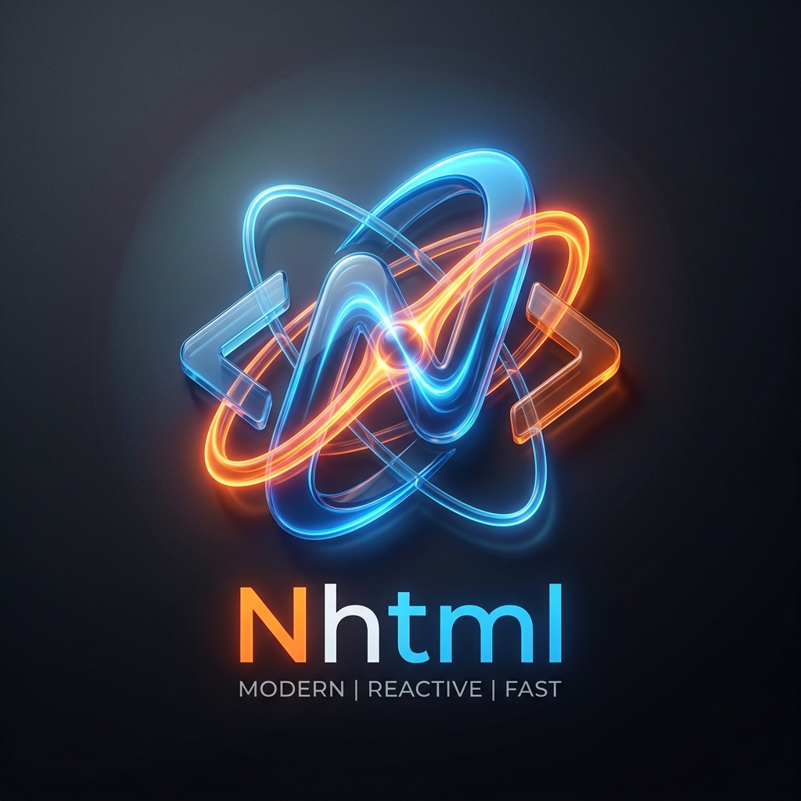

# ⚛️ Nhtml

<p align="center">
  
</p>

<p align="center">
  
  
  
  
  
</p>

---

## ⚡ HTML. But reactive.

**Nhtml is HTML with built-in reactivity — no framework, no build step, no Node.js.**

Write interactive interfaces using **pure HTML syntax**, compiled by a **Rust engine**, and hydrated with **<2KB of JavaScript**.

---

## 🔥 Why Nhtml exists

Modern web dev is overkill for most use cases:

* ❌ React / Vue → heavy, complex, JS everywhere
* ❌ Build tools → slow, fragile, hard to maintain
* ❌ Simple UI → requires full SPA stack

👉 **Nhtml solves this.**

> You get interactivity without leaving HTML.

---

## 🧠 Example

```html
<var count=0>

<div class="card">
  <h2>Counter: {count}</h2>

  <button on:click="count++">+</button>
  <button on:click="count--">-</button>

  <if condition="count > 10">
    <p>🔥 Impressive</p>
  </if>
</div>
```

👉 No framework
👉 No virtual DOM
👉 No state management

Just HTML.

---

## ⚔️ Nhtml vs React (real talk)

| Feature        | React       | Nhtml     |
| -------------- | ----------- | --------- |
| Setup          | ⚠️ Required | ✅ None    |
| JS Required    | ✅ Yes       | ❌ No      |
| Bundle Size    | ❌ 40KB+     | ✅ <2KB    |
| Complexity     | ❌ High      | ✅ Low     |
| Learning Curve | ❌ Medium    | ✅ Minimal |

---

## 🧩 Where Nhtml shines

✔ Dashboards
✔ CRUD interfaces
✔ CMS / Admin panels
✔ Server-rendered apps
✔ Progressive enhancement

👉 Anywhere React is **overkill**

---

## 🔌 Works everywhere

Nhtml is not a framework. It’s a **rendering engine**.

Use it with:

* PHP (native integration)
* Rust (core runtime)
* WebAssembly (browser)
* Node / Python (via rendering layer)

👉 Drop it into existing projects.

---

## 🚀 Key features

* ⚡ **Rust-powered engine** → ultra fast compilation
* 🧱 **HTML-first syntax** → no new mental model
* 🌍 **Multi-runtime** → server + browser
* ✨ **Ultra-light hydration** → <2KB JS
* 🔌 **Framework-agnostic** → works alongside anything

---

## ⚡ Installation

See full guides in [`docs/`](./docs/):

* [PHP (server-side rendering)](./docs/INSTALL-PHP.md)
* [Apache / Nginx direct integration](./docs/INSTALL-DIRECT.md)
* [Browser (WASM)](./docs/INSTALL-WASM.md)

---

## 🧪 Real-world usage

👉 See **NCMS** (real CMS built with Nhtml):
[https://github.com/NemStudio18/NCMS](https://github.com/NemStudio18/NCMS)

---

## 🎯 Philosophy

> The web was meant to be simple.

Nhtml brings back:

* HTML as the source of truth
* Minimal runtime
* No toolchain
* No unnecessary abstraction

---

# 🇫🇷 Version Française

## ⚡ HTML. Mais réactif.

**Nhtml est du HTML avec réactivité intégrée — sans framework, sans build, sans Node.js.**

👉 Vous écrivez du HTML
👉 Vous obtenez une interface interactive

---

## Pourquoi Nhtml ?

Le web moderne est devenu inutilement complexe :

* React / Vue → lourds
* Tooling → fragile
* JS partout → difficile à maintenir

👉 **Nhtml simplifie tout.**

---

## 🧠 Exemple

```html
<var count=0>

<div class="card">
  <h2>Compteur : {count}</h2>

  <button on:click="count++">+</button>
  <button on:click="count--">-</button>

  <if condition="count > 10">
    <p>🔥 Impressionnant</p>
  </if>
</div>
```

---

## Points forts

* ⚡ Moteur Rust ultra rapide
* 🌍 Multi-runtime (PHP, WASM…)
* ✨ Runtime JS < 2Ko
* 🔌 Compatible avec vos projets existants

---

## Cas d’usage

* Admin panels
* CMS
* Interfaces CRUD
* Apps SSR

---

## Installation

Voir [`/docs/`](./docs/) pour les guides complets.

---

© 2026 NemStudio — Built for simplicity.
