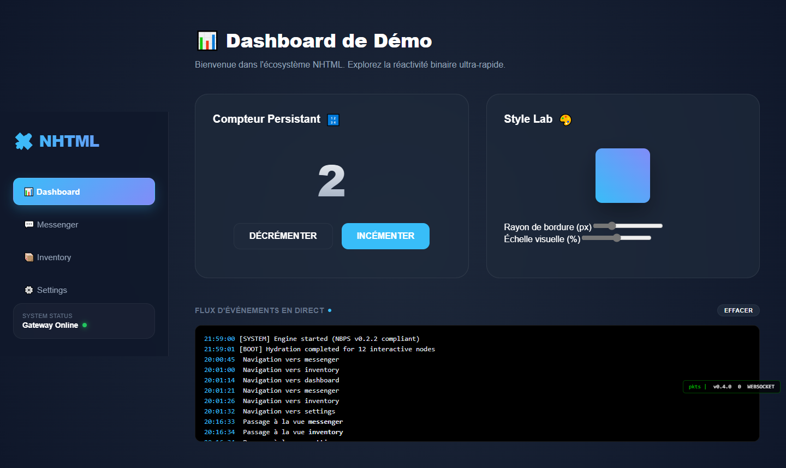
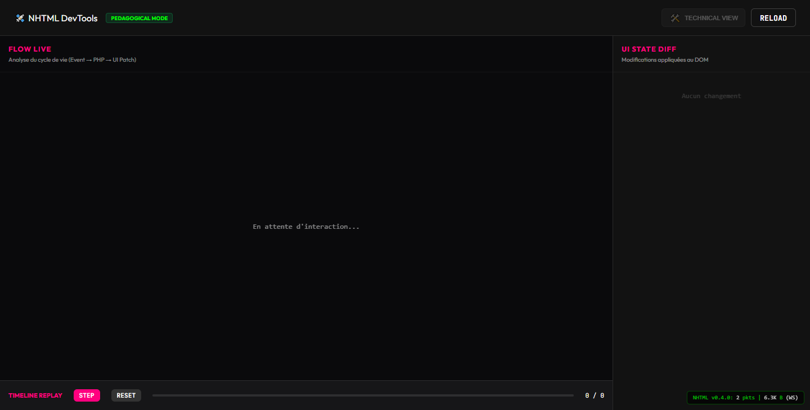
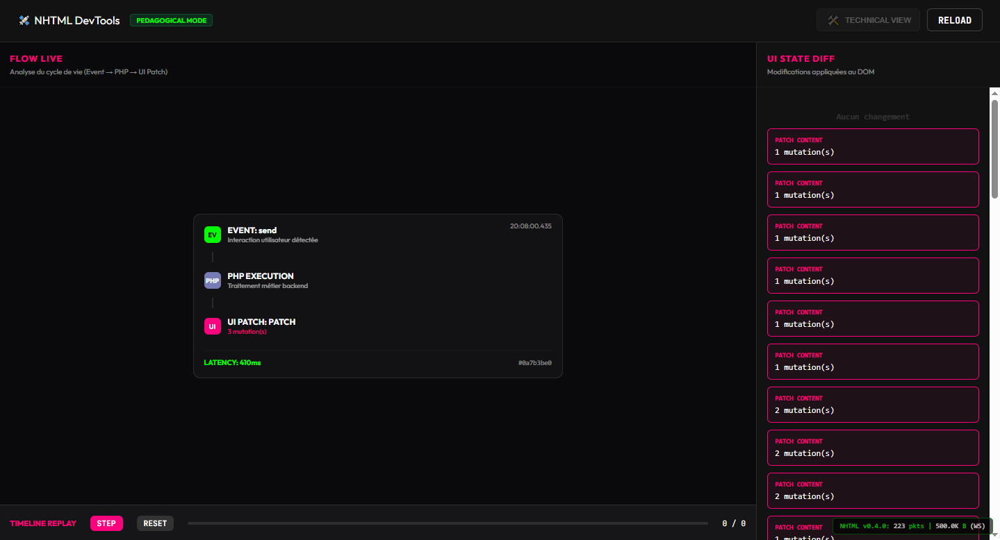
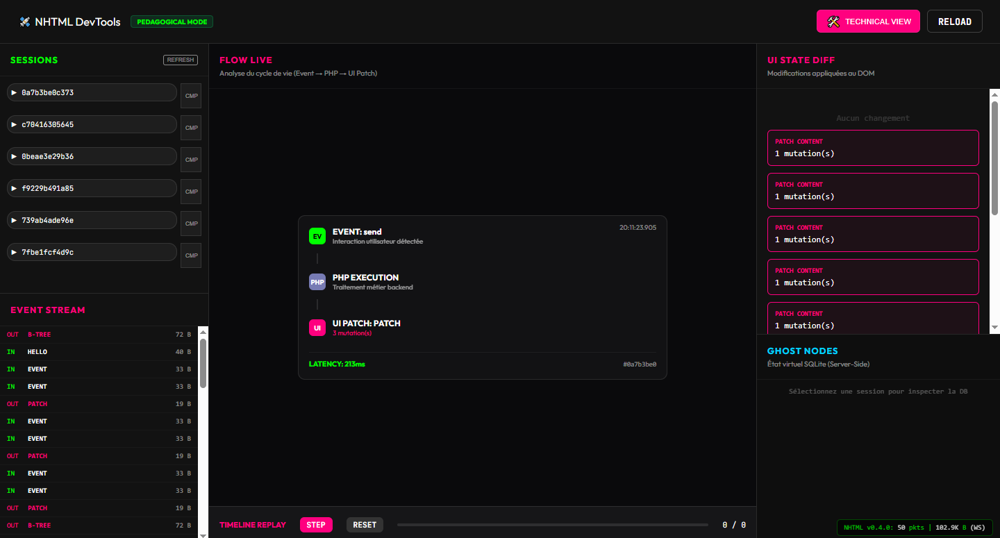

# 🛰️ NHTML — The Server-Driven DOM Protocol

<p align="center">
  
</p>

<p align="center">
  
  
  
  
</p>

[English](#-english-version) | [Français](#-version-française)

---

## 🇬🇧 English Version

### ⚡ Reactive web. Without writing JavaScript.

**NHTML is a Server-Driven UI protocol and runtime.** You write augmented HTML and PHP. The Rust Gateway handles the rest — binary transport, atomic DOM mutations, and native real-time.

**v0.7.1 Highlights**: Industrial Hardening, Zero-Panic Runtime, and Ultra-Fast Compilation Caching (~1ms overhead).

Zero React. Zero Vue. Zero build step. Zero business JS to write.

---

### 🧠 What it looks like

**Interface side (`index.nhtml`)** — HTML with super-powers:

```html
<h1 n-id="title">Hello</h1>

<p>
  You clicked
  <strong n-id="counter">0</strong> times.
</p>

<button n-click="page.increment">Click here</button>

<div n-id="message" n-live></div>
```

**Server side (`app.php`)** — Pure PHP:

```php
function page_increment(NhtmlEvent $event): array
{
    $count = ++$_SESSION['clicks'];

    return [
        Patch::setText('counter', (string)$count),
        Patch::setText('message', $count === 10 ? '🎉 Tenth click!' : ''),
    ];
}
```

👉 No JSON to write. No fetch(). No client-side state to manage.

---

### 🖼️ Showcase in Action


*The Premium Showcase MVC demonstrating real-time data binding, inventory management, and multi-view navigation.*

---

### 🛠️ Built-in DevTools

NHTML includes a complete control station accessible locally at `http://127.0.0.1:8081`:



#### ✨ Key Features
- **Network Monitor** — every NBPS packet in real-time.
- **Time Travel** — replay any session action by action.
- **Node Inspector** — binary state of every DOM node.
- **State Diff Viewer** — visualize mutations before/after.

#### 📽️ DevTools in Action
<p align="center">
  
  
</p>

---

### 🏛️ How it works

```
Your .nhtml + app.php
        │
        ▼
[ Rust Gateway ]  ←──────────────────────────────┐
        │                                         │
        │  WebSocket (Binary NBPS Protocol)       │
        │                                         │
        ▼                                         │
[ Browser ]                                 [ PHP Backend ]
  bridge.js (~25KB)   EVENT (click) ────────▶  Business Logic
  Applies PATCHES     PATCH (mutations) ◀────  Returns ops
```

---

### 🌐 Flexible Deployment

NHTML adapts to any infrastructure without changing a single line of your code:

1.  **Dedicated (Rust Gateway)**: Best for high-performance apps. The binary handles everything (WebSockets, HTTP, PHP).
2.  **Shared (Standard PHP)**: Perfect for standard hosting (OVH, etc.). Uses HTTP fallback for reactive updates.
3.  **Zero-Server (PHP-WASM)**: Ideal for static sites (GitHub Pages). The PHP logic runs directly in the user's browser via WebAssembly.

---

### 🚀 Quick Start

```bash
# 1. Start the gateway
./nhtml start --dev

# 2. Visit http://localhost:8080
```

[Read full English Documentation](./docs/en/SPEC.md)

---

### ⚖️ License
NHTML uses a **Triple-License** model to support both the community and commercial users:
- **SDKs & Bridge**: [MIT License](./LICENSE_MIT) — Free to use in any project.
- **Gateway (Core)**: [AGPL v3](./LICENSE_AGPL) — Open Source Copyleft.
- **Enterprise**: [Commercial License](./LICENSE_COMMERCIAL.md) — For proprietary/closed-source use.

---

## 🇫🇷 Version Française

### ⚡ Le web réactif. Sans écrire de JavaScript.

**NHTML est un protocole et runtime Server-Driven UI.** Vous écrivez du HTML augmenté et du PHP. Le Gateway Rust s'occupe du reste — transport binaire, mutations DOM atomiques, temps réel natif.

**Points forts v0.7.1** : Durcissement Industriel, Runtime "Zero-Panic", et Cache de Compilation Ultra-Rapide (~1ms d'overhead).

Zéro React. Zéro Vue. Zéro build step. Zéro JS métier à écrire.

---

### 🧠 À quoi ça ressemble

**Côté interface (`index.nhtml`)** — du HTML avec des super-pouvoirs :

```html
<h1 n-id="titre">Bonjour</h1>

<p>
  Tu as cliqué
  <strong n-id="compteur">0</strong> fois.
</p>

<button n-click="page.incrementer">Cliquer ici</button>

<div n-id="message" n-live></div>
```

**Côté serveur (`app.php`)** — du PHP pur :

```php
function page_incrementer(NhtmlEvent $event): array
{
    $count = ++$_SESSION['clicks'];

    return [
        Patch::setText('compteur', (string)$count),
        Patch::setText('message', $count === 10 ? '🎉 Dixième clic !' : ''),
    ];
}
```

👉 Pas de JSON à écrire. Pas de fetch(). Pas d'état côté client à gérer.

---

### 🖼️ Showcase en Action


*L'application Showcase MVC démontrant le binding de données en temps réel, la gestion d'inventaire et la navigation multi-vues.*

---

### 🛠️ DevTools intégrés

NHTML inclut une station de contrôle complète accessible localement sur `http://127.0.0.1:8081` :


#### ✨ Fonctionnalités Clés
- **Network Monitor** — chaque paquet NBPS en temps réel.
- **Time Travel** — rejouer n'importe quelle session action par action.
- **Node Inspector** — état binaire de chaque nœud DOM.
- **State Diff Viewer** — visualiser les mutations avant/après.

#### 📽️ DevTools en Action
<p align="center">
  
  
</p>

---

### 🏛️ Comment ça marche

```
Votre .nhtml + app.php
        │
        ▼
[ Gateway Rust ]  ←──────────────────────────────┐
        │                                         │
        │  WebSocket (Protocole NBPS Binaire)     │
        │                                         │
        ▼                                         │
[ Navigateur ]                              [ PHP Backend ]
  bridge.js (~25KB)   EVENT (clic) ────────▶  Logique métier
  Applique les PATCH  PATCH (mutations) ◀────  Renvoie les ops
```

---

### 🌐 Déploiement Flexible

NHTML s'adapte à n'importe quelle infrastructure sans changer une seule ligne de votre code :

1.  **Dédié (Gateway Rust)** : Idéal pour la performance. Le binaire gère tout (WebSockets, HTTP, PHP).
2.  **Mutualisé (PHP Standard)** : Parfait pour les hébergements classiques (OVH, etc.). Utilise un fallback HTTP pour la réactivité.
3.  **Zéro-Serveur (PHP-WASM)** : Idéal pour les sites statiques (GitHub Pages). La logique PHP tourne directement dans le navigateur via WebAssembly.

---

### 🚀 Démarrage rapide

```bash
# 1. Lancer le gateway
./nhtml start --dev

# 2. Visiter http://localhost:8080
```

[Lire la documentation complète en Français](./docs/fr/SPEC.md)

---

## 📄 Licensing

NHTML is distributed under a **Triple-License** model to support both open-source and professional usage:

- **MIT License**: For SDKs (PHP, Python, etc.) and client-side bridge.
- **AGPL v3 License**: For the Gateway Core (Rust). This ensures the core remains free and improvements are contributed back.
- **Commercial License**: For enterprise usage requiring proprietary integration or bypassing AGPL obligations.

See `LICENSE_MIT`, `LICENSE_AGPL.txt`, and `LICENSE_COMMERCIAL.txt` for details.

---

## 📄 Licences (FR)

NHTML utilise un modèle de **Triple-Licence** :

- **Licence MIT** : Pour les SDKs et le bridge client.
- **Licence AGPL v3** : Pour le cœur de la Gateway (Rust). Garantit que le moteur reste libre.
- **Licence Commerciale** : Pour un usage propriétaire ou s'affranchir des obligations AGPL.

Consultez `LICENSE_MIT`, `LICENSE_AGPL.txt`, et `LICENSE_COMMERCIAL.txt` pour plus d'informations.

---

<p align="center">
  © 2026 NemStudio18 — Built for simplicity. Powered by Rust.
</p>
